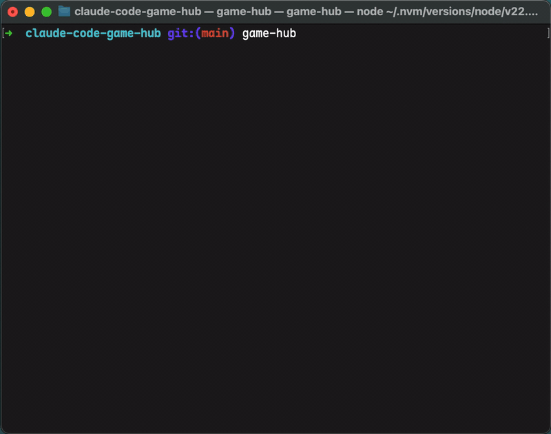

# claude-code-game-hub

Play games while Claude Code is working.
Press `Ctrl+G` any time to toggle between the game and Claude.



## Install

```bash
npm install -g claude-code-game-hub
```

This also registers the Claude plugin hooks.

## Usage

Once installed, just use `claude` normally. When you submit a prompt, game-mode activates; when Claude finishes or asks for input, the status line updates. The built-in game is Snake.

- `Ctrl+G` — toggle between game-mode and claude-mode
- `/game-hub:list` — list installed games
- `/game-hub:switch <id>` — switch active game
- `/game-hub:install <pm> <spec>` — install a new game (npm, brew, cargo, pip, …)
- `/game-hub:disable` / `/game-hub:enable` — turn game-mode off/on

## Configuration

- `GAME_HUB_PORT` (default `41731`) — HTTP port for hook events.

## Advanced install

Re-running `npm install -g claude-code-game-hub` refreshes the plugin to the latest GitHub HEAD (Claude Code restart required to apply). If `claude` wasn't on PATH at install time, or you installed without `-g`, register manually once:

```
claude plugin marketplace add vivaxy/claude-code-game-hub
claude plugin install game-hub@claude-code-game-hub
```

To uninstall: `npm uninstall -g claude-code-game-hub` removes the plugin automatically. If you used a local (non-global) install, npm's preuninstall hook won't fire — run these manually:

```
claude plugin uninstall game-hub@claude-code-game-hub
claude plugin marketplace remove claude-code-game-hub
```

The plugin registers `UserPromptSubmit`, `Stop`, and `Notification` hooks that POST to `http://127.0.0.1:${GAME_HUB_PORT:-41731}/event`. The hooks are no-ops when game-hub isn't running (`curl --connect-timeout 0.1`).
