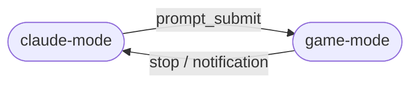

# Design

## Component Map

```
hook-server  →  emitter  →  state (StateMachine)  →  terminal-mux (TerminalMux)
                                                           ↕
                                                       pty-claude
                                                           ↕
                                                     current Game
```

`hook-server` receives HTTP POST events from Claude Code hooks and fires them onto the `EventEmitter`. The `StateMachine` reacts to events and emits `transition` signals. `TerminalMux` listens for transitions and switches input/output routing between Claude's PTY and the active `Game`.

## State Machine



Implemented in `src/state.ts`. On each transition a 80 ms stdin drain window is set (`drainUntil`) so in-flight keystrokes from the old mode are discarded.

## Architecture Invariants

1. **No wrapper-level alt-screen toggling.** Terminals have one main + one alt buffer; they don't stack. Claude Code already lives in the alt-screen. The hub never issues `ESC[?1049h`/`l` — both modes share whatever screen Claude set up.

2. **Explicit input ownership per mode.** In `claude-mode`, stdin is piped to the PTY. In `game-mode`, stdin goes to the game's key handler; nothing reaches the PTY. On each mode switch, a brief 80 ms drain window discards in-flight bytes.

## Adding a New Game

### Option A — Built-in (TypeScript)

1. Implement the `Game` interface from `src/games/index.ts`:

```typescript
export interface Game {
  resume(): void;
  pause(): void;
  handleInput(key: string): void;
  resize(cols: number, rows: number): void;
  dispose?(): void;
}
```

2. Add the game id and instantiation logic to `src/games/registry.ts` (`instantiateGame` and `listAllGames`).
3. The game is automatically available for `/game-hub:switch`.

### Option B — External npm plugin (subprocess)

Publish an npm package with a `"game-hub"` field in `package.json`:

```json
{
  "game-hub": {
    "type": "subprocess",
    "id": "my-game",
    "name": "My Game",
    "description": "Short description",
    "command": "node",
    "args": ["dist/main.js"]
  }
}
```

Users install it with `/game-hub:install my-game-package`. The registry wraps it in `SubprocessGame` (`src/games/subprocess.ts`) which manages the child process and proxies PTY I/O.

## Key Files

| File | Role |
|---|---|
| `src/index.ts` | Main entry: wires hook-server → emitter → state → mux; manages enable/disable and game switching |
| `src/state.ts` | `StateMachine`: mode transitions + stdin drain window |
| `src/terminal-mux.ts` | PTY output buffering, input routing, screen transitions between modes |
| `src/hook-server.ts` | `node:http` server that receives hook POST events and exposes game management API |
| `src/pty-claude.ts` | Spawns `claude` under `node-pty` |
| `src/config.ts` | Load/save persistent config (enabled flag, current game ID, installed games) |
| `src/plugin-check.ts` | Warns at startup if the Claude Code plugin is not installed |
| `src/games/index.ts` | `Game` interface definition |
| `src/games/snake.ts` | Built-in Snake implementation |
| `src/games/subprocess.ts` | `SubprocessGame`: wraps an external game process |
| `src/games/registry.ts` | Instantiate, list, and resolve game plugins (built-in + npm) |
| `plugin/hooks/hooks.json` | Claude Code plugin hook definitions |
