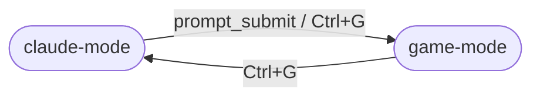

# Design

## Component Map

```
hook-server  →  emitter  →  state (StateMachine)  →  terminal-mux (TerminalMux)
                                                           ↕             ↕
                                                       pty-claude      Header
                                                           ↕
                                                     current Game
```

`hook-server` receives HTTP POST events from Claude Code hooks and fires them onto the `EventEmitter`. The `StateMachine` reacts to events and emits `transition` and `status` signals. `TerminalMux` listens for transitions and switches input/output routing between Claude's PTY and the active `Game`. `Header` (owned by `TerminalMux`) renders the Claude-status line on row 1.

## State Machine



Implemented in `src/state.ts`. On each transition a 80 ms stdin drain window is set (`drainUntil`) so in-flight keystrokes from the old mode are discarded.

Claude status (`working` / `waiting-for-input` / `idle`) is tracked orthogonally to mode in `StateMachine.status`. It is updated by hook events and emits a `'status'` event, but never causes a mode transition.

## Reserved Top Row (game-mode only)

Row 1 is reserved for the status header **only while in game-mode**. In claude-mode, Claude owns the full terminal.

- **Claude-mode (including boot):** Claude's PTY is sized to the full terminal `rows`; no DECSTBM margin is set. The hub emits no screen-modifying escapes on boot.
- **Entering game-mode:** resize Claude's PTY to `rows − 1`, set DECSTBM `\x1b[2;{rows}r`, clear the screen, paint the header at row 1. Games receive `rows − 1` via `resize()`; Snake's `offRow` already offsets `+1` to start content at row 2.
- **Returning to claude-mode:** reset DECSTBM (`\x1b[r`), resize Claude's PTY back to full `rows`, replay any buffered PTY output, then resize-bounce (`cols+1`/`cols`) to force a repaint.
- **Terminal resize:** in claude-mode propagate full `rows` to the PTY with no margin write; in game-mode propagate `rows − 1` and re-apply margins.

This sidesteps the xterm per-buffer DECSTBM behavior on the alt-screen: Claude runs unconstrained in the buffer it actually paints on.

## Claude Status Indicator

`src/header.ts` exports a `Header` class owned by `TerminalMux`. On each status change or mode switch, `TerminalMux.updateHeader()` is called:

- In claude-mode: stops any flash timer; does not paint.
- In game-mode: renders the current status on row 1; if status is `waiting-for-input`, starts a 500 ms flash timer alternating between yellow and red.

The flash timer is torn down in `restoreTerminal()`.

## Architecture Invariants

1. **No wrapper-level alt-screen toggling.** Terminals have one main + one alt buffer; they don't stack. Claude Code already lives in the alt-screen. The hub never issues `ESC[?1049h`/`l` — both modes share whatever screen Claude set up.

2. **Explicit input ownership per mode.** In `claude-mode`, stdin is piped to the PTY. In `game-mode`, stdin goes to the game's key handler; nothing reaches the PTY. On each mode switch, a brief 80 ms drain window discards in-flight bytes.

3. **Hook events never cause game→claude transitions.** `Stop` and `Notification` hooks update `ClaudeStatus` only. `Ctrl+G` is the sole user-driven toggle between modes; subprocess self-exit triggers claude-mode via `onGameExit`.

## Adding a New Game

### Option A — Built-in (TypeScript)

1. Implement the `Game` interface from `src/games/index.ts`:

```typescript
export interface Game {
  resume(): void;
  pause(): void;
  handleInput(key: string): void;
  resize(cols: number, rows: number): void;
  dispose?(): void;
}
```

2. Add the game id and instantiation logic to `src/games/registry.ts` (`instantiateGame` and `listAllGames`).
3. The game is automatically available for `/game-hub:switch`.

### Option B — External plugin (subprocess)

Publish a package with a `"game-hub"` field in `package.json`:

```json
{
  "game-hub": {
    "type": "subprocess",
    "id": "my-game",
    "name": "My Game",
    "description": "Short description",
    "command": "node",
    "args": ["dist/main.js"]
  }
}
```

Users install it with `/game-hub:install <pm> <spec>`:

- **Node PMs** (npm, pnpm, yarn, bun): the hub takes a before/after snapshot of the PM's global `node_modules`, runs the install, then finds the newly added package whose `package.json` has a `game-hub` field. The `spec` is anything the PM accepts (registry name, `github:user/repo`, git URL, local path, tarball). On failure the hub rolls back via the PM's uninstall command.
- **System PMs** (brew, cargo, pip, and any other): the hub runs `<pm> install <spec>` and auto-registers the binary using the spec's last path component as the command, id, and name. If the actual binary name differs, the user can correct it with `/game-hub:uninstall <id>` then `/game-hub:register <id> <real-command>`.

The uninstall command (`/game-hub:uninstall`) uses the `packageManager` stored in config to run the correct PM's uninstall command. The registry wraps the result in `SubprocessGame` (`src/games/subprocess.ts`) which manages the child process and proxies PTY I/O.

For games already on PATH (installed by any means), use `/game-hub:register <id> <command>` — the hub does not need to know how the binary was installed.

## Key Files

| File | Role |
|---|---|
| `src/index.ts` | Main entry: wires hook-server → emitter → state → mux; manages enable/disable and game switching |
| `src/state.ts` | `StateMachine`: mode transitions + stdin drain window |
| `src/terminal-mux.ts` | PTY output buffering, input routing, screen transitions between modes |
| `src/hook-server.ts` | `node:http` server that receives hook POST events and exposes game management API |
| `src/pty-claude.ts` | Spawns `claude` under `node-pty` |
| `src/config.ts` | Load/save persistent config (enabled flag, current game ID, installed games) |
| `src/plugin-check.ts` | Warns at startup if the Claude Code plugin is not installed |
| `src/games/index.ts` | `Game` interface definition |
| `src/games/snake.ts` | Built-in Snake implementation |
| `src/games/subprocess.ts` | `SubprocessGame`: wraps an external game process |
| `src/games/registry.ts` | Instantiate, list, and resolve game plugins (built-in + npm) |
| `src/header.ts` | `Header`: renders the Claude-status line on row 1 of the terminal |
| `plugin/hooks/hooks.json` | Claude Code plugin hook definitions |
